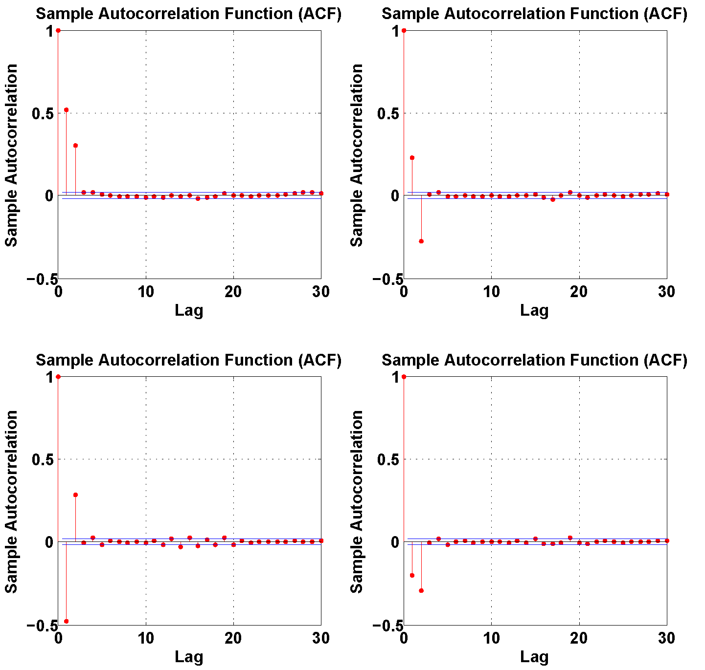
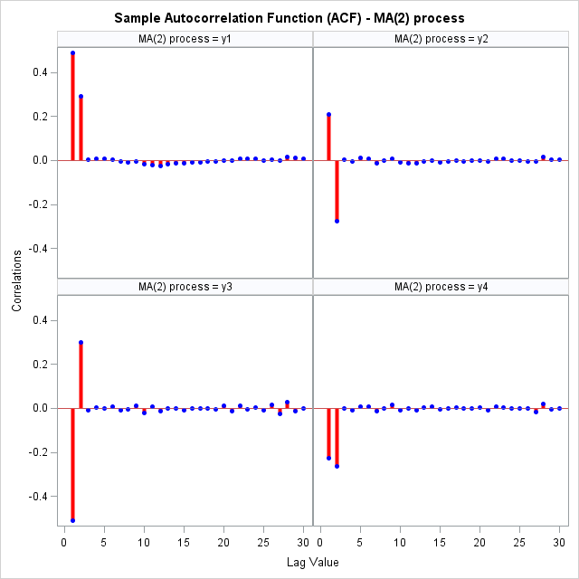
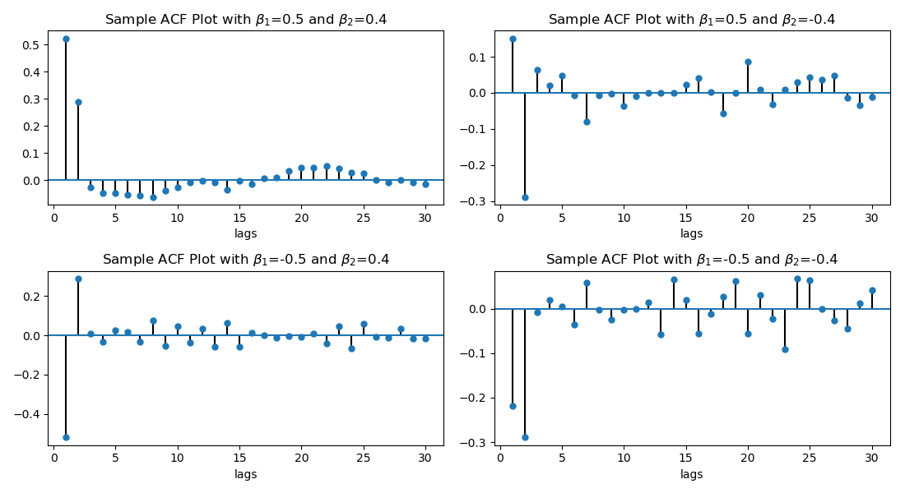

[](http://quantlet.de/)

## [](http://quantlet.de/) **SFEacfma2** [](http://quantlet.de/)

```yaml


Name of QuantLet : SFEacfma2
Published in: Statistics of Financial Markets
Description: 'Plots the autocorrelation function of a MA(2) (moving average) process for different parameters.'
Keywords:
- acf
- arma
- autocorrelation
- correlation
- discrete
- graphical representation
- linear
- moving-average
- plot
- process
- simulation
- stationary
- stochastic
- stochastic-process
- time-series
See also:
- SFEacfar1
- SFEacfar2
- SFEacfma1
- SFEpacfma2

Author[R]: Joanna Tomanek
Author[Matlab]: Ying Chen, Christian M. Hafner, Lasse Groth
Author[SAS]: Daniel T. Pele
Author[Python]: Justin Hellermann

Submitted[R]: Mon, June 08 2015 by Lukas Borke
Submitted[Matlab]: Tue, January 19 2010 by Lasse Groth
Submitted[SAS]: Tue, June 17 2014 by Sergey Nasekin
Submitted[Python]: Justin Hellermann

Input:
- beta1: value of beta_1
- beta_2: value of beta_2
- lag: lag value

Example: 'Plots the ACF of a MA(2) process with beta1=0.5, beta2=0.4 (top left), beta1=0.5, beta2=-0.4 (top right),
beta1=-0.5, beta2=0.4 (bottom left) and beta1=-0.5, beta2=-0.4 (bottom right).'

Example[Matlab]: 'User inputs the SFEacfma2 parameters [lag, beta1, beta2] as [30, 0.5, 0.4].
Plots of the autocorrelation function of MA(2) processes with [β1,β2] = [+/- 0.5, +/- 0.4] are given.'

```








### R Code
```r


rm(list = ls(all = TRUE))
graphics.off()

# parameter settings
lag	= 30	# lag value
b1	= 0.5	# value of beta_1
b2	= 0.4	# value of beta_2

par(mfrow = c(2, 2))

plot(ARMAacf(ar = numeric(0), ma = c(b1, b2), lag.max = lag, pacf = FALSE), 
    type = "h", xlab = "Lag", ylab = "Sample ACF")
title("ACF")

plot(ARMAacf(ar = numeric(0), ma = c(b1, -b2), lag.max = lag, pacf = FALSE), 
    type = "h", xlab = "Lag", ylab = "Sample ACF")
title("ACF")

plot(ARMAacf(ar = numeric(0), ma = c(-b1, b2), lag.max = lag, pacf = FALSE), 
    type = "h", xlab = "Lag", ylab = "Sample ACF")
title("ACF")

plot(ARMAacf(ar = numeric(0), ma = c(-b1, -b2), lag.max = lag, pacf = FALSE), 
    type = "h", xlab = "Lag", ylab = "Sample ACF")
title("ACF") 

```

automatically created on 2019-08-01

### MATLAB Code
```matlab


clear
clc
close all

% user inputs parameters
disp('Please input lag value lag, value of beta1, value of beta2 as: [30, 0.5, 0.4]') 
disp(' ') ;
para=input('[lag, beta1, beta2]=');

while length(para) < 3
    disp('Not enough input arguments. Please input in 1*3 vector form like [30, 0.5, 0.4] or [30 0.5 0.4]');
    para=input('[lag, beta1, beta2]=');
end

lag=para(1);
beta1=para(2);
beta2=para(3);

% main computation
randn('state', 0)                      % Start from a known state.
x = randn(10000, 1);                   % 10000 Gaussian deviates ~ N(0, 1).
y1 = filter([1 beta1 beta2], 1, x);    % Create an MA(2) process.
y2 = filter([1 beta1 -beta2], 1, x);   % Create an MA(2) process.
y3 = filter([1 -beta1 beta2], 1, x);   % Create an MA(2) process.
y4 = filter([1 -beta1 -beta2], 1, x);  % Create an MA(2) process.

subplot(2,2,1)
autocorr(y1, lag, [], 2);              % Plot ACF for β1 = 0.5, β2 = 0.4

subplot(2,2,2)
autocorr(y2, lag, [], 2);              % Plot ACF for β1 = 0.5, β2 = −0.4

subplot(2,2,3) 
autocorr(y3, lag, [], 2);              % Plot ACF for β1 = −0.5, β2 = 0.4

subplot(2,2,4)
autocorr(y4, lag, [], 2);              % Plot ACF for β1 = −0.5, β2 = −0.4

```

automatically created on 2019-08-01

### PYTHON Code
```python

import pandas as pd
import numpy as np
from statsmodels.graphics.tsaplots import plot_acf
from statsmodels.tsa.arima_process import arma_generate_sample
import matplotlib.pyplot as plt


# parameter settings
lags = 30    # lag value
n = 1000
alphas = np.array([0.])

# add zero-lag and negate alphas
ar = np.r_[1, -alphas]
ma1 = np.r_[1, np.array([0.5,0.4])]
ma2 = np.r_[1, np.array([-0.5,0.4])]
ma3 = np.r_[1, np.array([-0.5,-0.4])]
ma4 = np.r_[1, np.array([0.5,-0.4])]


f, axarr = plt.subplots(2, 2,figsize=(11, 6))
simulated_data_1 = arma_generate_sample(ar=ar, ma=ma1, nsample=n) 
plot_acf(simulated_data_1,lags=lags,alpha=None,zero=False, ax=axarr[0, 0],title='Sample ACF Plot with '+r'$\beta_1$='+str(ma1[1])+' and '+r'$\beta_2$='+str(ma1[2]))
axarr[0, 0].set_xlabel('lags')
simulated_data_2 = arma_generate_sample(ar=ar, ma=ma2, nsample=n) 
plot_acf(simulated_data_2,lags=lags,alpha=None,zero=False, ax=axarr[0, 1],title='Sample ACF Plot with '+r'$\beta_1$='+str(ma2[1])+' and '+r'$\beta_2$='+str(ma2[2]))
axarr[0, 1].set_xlabel('lags')
simulated_data_3 = arma_generate_sample(ar=ar, ma=ma3, nsample=n) 
plot_acf(simulated_data_3,lags=lags,alpha=None,zero=False, ax=axarr[1, 0],title='Sample ACF Plot with '+r'$\beta_1$='+str(ma3[1])+' and '+r'$\beta_2$='+str(ma3[2]))
axarr[1, 0].set_xlabel('lags')
simulated_data_4 = arma_generate_sample(ar=ar, ma=ma4, nsample=n) 
plot_acf(simulated_data_4,lags=lags,alpha=None,zero=False, ax=axarr[1,1],title='Sample ACF Plot with '+r'$\beta_1$='+str(ma4[1])+' and '+r'$\beta_2$='+str(ma4[2]))
axarr[1, 1].set_xlabel('lags')
plt.tight_layout()

plt.savefig('SFEacfma2_py.png')
plt.show()
```

automatically created on 2019-08-01

### SAS Code
```sas


goptions reset=all;

* user inputs parameters
* Please input lag value lag, value of beta1, value of beta2 as: [30, 0.5, 0.4]; 

%let lag	= 30;
%let beta1	= 0.5;
%let beta2	= 0.4;


* main computation;
data ma;
do t = 1 to 10000;
eps=rannor(0);			*Generate the Gaussian white noise with 10000 observations;
output;
end;

data ma;set ma;
y1 = eps+&beta1*lag(eps)+&beta2*lag2(eps);	*Generate the MA(2) process;
y2 = eps+&beta1*lag(eps)-&beta2*lag2(eps);	*Generate the MA(2) process;
y3 = eps-&beta1*lag(eps)+&beta2*lag2(eps);	*Generate the MA(2) process;
y4 = eps-&beta1*lag(eps)-&beta2*lag2(eps);	*Generate the MA(2) process;

run;

*Compute the ACF;

proc arima data = ma ;
identify var = y1  nlag = &lag outcov = acf1 noprint;
identify var = y2  nlag = &lag outcov = acf2 noprint;
identify var = y3  nlag = &lag outcov = acf3 noprint;
identify var = y4  nlag = &lag outcov = acf4 noprint;
run;
quit;


proc append data = acf2 base = acf1;
proc append data = acf3 base = acf1;
proc append data = acf4 base = acf1;
run;

data acf1;set acf1;
if lag=0 then delete;

data acf1;set acf1;
label var="MA(2) process";

*Plot the ACF graph;

title Sample Autocorrelation Function (ACF) - MA(2) process;

proc sgpanel data = acf1 ;
panelby var;
needle x = lag y = corr / markers
lineattrs = (color = red THICKNESS = 4)
markerattrs = ( symbol=circlefilled 
color = blue size = 6) ;
refline 0 / transparency=0.5   ;

run;
quit;

```

automatically created on 2019-08-01