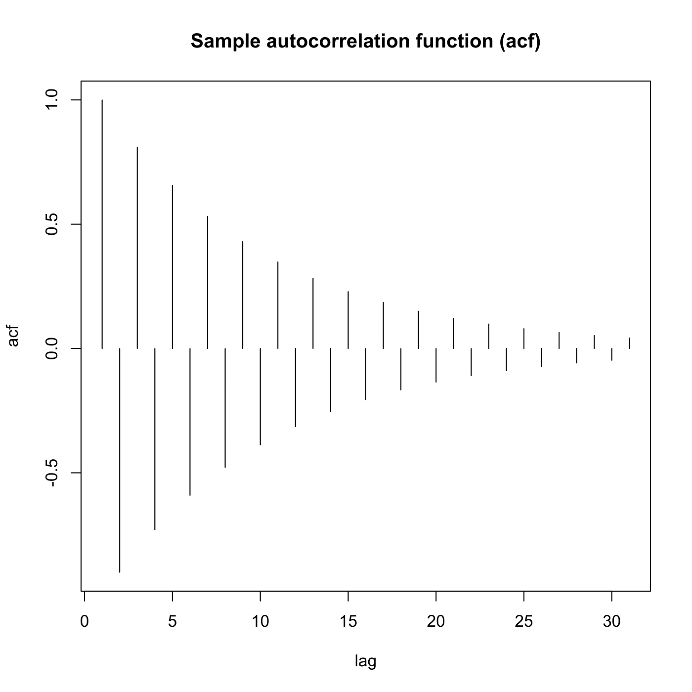

[](http://quantlet.de/)

## [](http://quantlet.de/) **SFEacfar1** [](http://quantlet.de/)

```yaml

Name of QuantLet: SFEacfar1

Published in: Statistics of Financial Markets

Description: 'Plots the autocorrelation function of an AR(1) (autoregressive) process.'

Keywords: acf, autocorrelation, autoregressive, discrete, graphical representation, linear, plot, process, simulation, stationary, stochastic, stochastic-process, time-series

See also: SFEacfar2, SFEacfma1, SFEacfma2, SFEpacfar2, SFEpacfma2, SFEfgnacf

Author: Joanna Tomanek, WK Härdle

Submitted: Fri, June 13 2014 by Felix Jung, 20190704 changes by WKH

Input: 
- a : alpha value
- lag : lag value

Example: 
- 1: a=0.9, lag=30
- 2: a=-0.9, lag=30

```




### R Code
```r


# clear variables and close windows
rm(list = ls(all = TRUE))
graphics.off()

# parameter settings, you might want to change these, check also the ACF if you enter e.g. a = -0.9
lag = 30  # lag value
a   = 0.9  # value of alpha_1

# Plot
plot(ARMAacf(ar = a, ma = numeric(0), lag.max = lag, pacf = FALSE), type = "h", 
    xlab = "lag", ylab = "acf")
title("Sample autocorrelation function (acf)")

```

automatically created on 2019-07-04