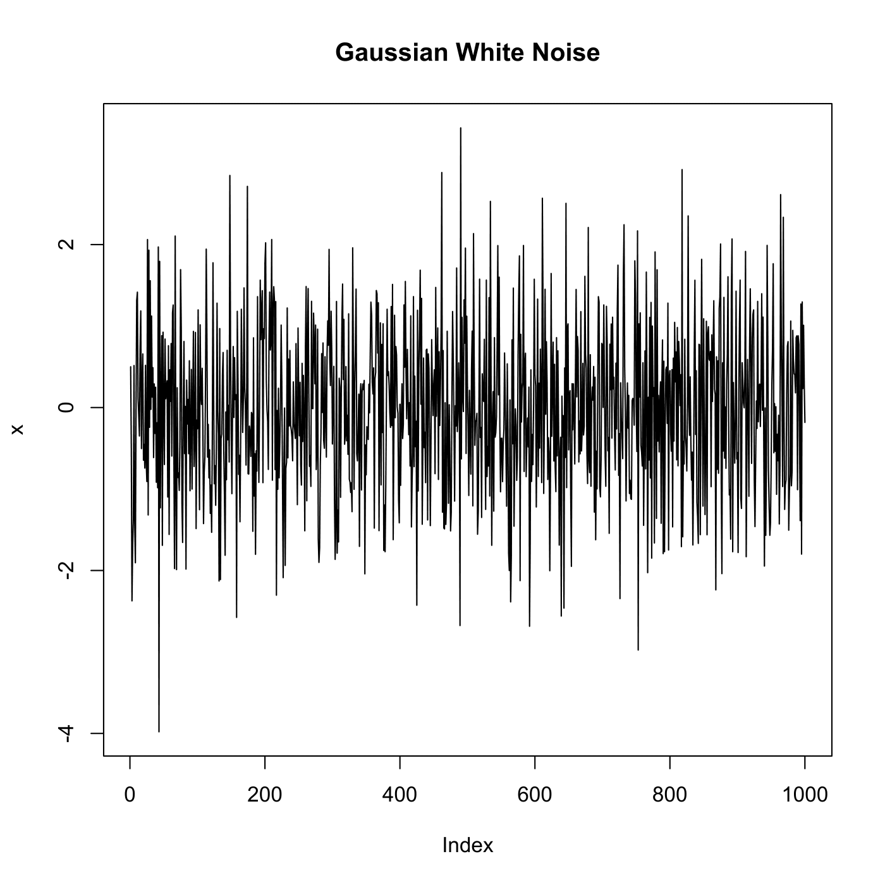

[](http://quantlet.de/)

## [](http://quantlet.de/) **SFEtimewn** [](http://quantlet.de/)

```yaml

Name of QuantLet: SFEtimewn

Published in: Statistics of Financial Markets

Description: 'Plots the time series of a Gaussian white noise.'

Keywords: distribution, normal, normal-distribution, simulation, stochastic-process, stochastic, process, white noise, gaussian, time-series, plot, graphical representation

See also: SFEtimegarch, SFEtimedax

Author: Joanna Tomanek
Author[Python]: Justin Hellermann

Submitted: Fri, June 13 2014 by Felix Jung
Submitted[Python]: Thu, Aug 01 2019 by Justin Hellermann

```




### R Code
```r


# clear variables and close windows
rm(list = ls(all = TRUE))
graphics.off()

x = rnorm(1000)  # Generate random normal distributed variable
plot(x, main = "Gaussian White Noise", type = "l")  # Plot
```

automatically created on 2019-08-01

### PYTHON Code
```python

import numpy as np
import matplotlib.pyplot as plt 

#set seed to have reproducible results
np.random.seed(10)
#sample 1000 normally distributed noise terms
wn=np.random.normal(0,1,1000)

#create a plot
plt.plot(wn)
plt.title('Gaussian White Noise')
plt.xlabel('Index')
plt.ylabel('x')
plt.savefig('TimeWN_py.png')
plt.show()


```

automatically created on 2019-08-01